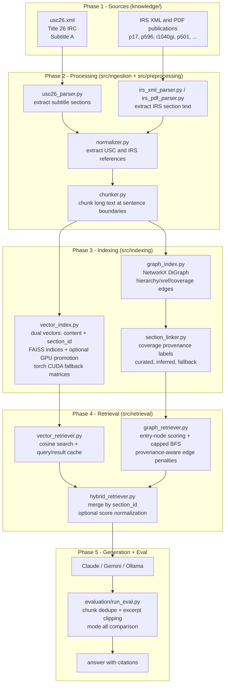

# Architecture

Hybrid GraphRAG system for federal income tax Q&A. The runtime combines:

- A graph channel for structured traversal across statute hierarchy, cross-references, and publication coverage edges
- A vector channel for semantic lookup over chunk text and canonical section IDs
- A hybrid merge channel that blends both signals before generation

Current vector retrieval is adaptive:

1. FAISS GPU search when FAISS CUDA bindings are available
2. Torch CUDA matrix search fallback when CUDA exists but FAISS GPU is unavailable
3. FAISS CPU fallback everywhere else

---

## Full Pipeline



---

## Graph Edge Model

```mermaid
flowchart LR
    subgraph USC["26 USC (statute)"]
        S32[26 USC section 32]
        S32a[26 USC section 32(a)]
        S32c[26 USC section 32(c)]
    end

    subgraph IRS["IRS publications"]
        P17[Pub 17]
        P596[Pub 596]
        EIC[Schedule EIC Instructions]
    end

    S32 -->|hierarchy| S32a
    S32 -->|hierarchy| S32c
    P17 -->|coverage| S32
    P596 -->|coverage| S32
    P17 -->|xref| P596
    P596 -->|xref| EIC
```

| Edge type | Primary source | Purpose |
| --- | --- | --- |
| hierarchy | XML structure | parent -> child statute navigation |
| xref | extracted references | explicit statute/pub cross-citations |
| coverage | section linker | publication-to-statute grounding |

Coverage edges now include provenance labels:

- curated_section
- curated_cross_pub
- inferred_section
- inferred_cross_pub
- fallback

Graph traversal can penalize lower-confidence inferred/fallback coverage edges,
which improves citation precision without removing fallback connectivity.

---

## Retrieval Flow

```mermaid
flowchart LR
    Q[User question] --> VQ[Vector query\ncontent + optional section_id]
    Q --> GQ[Graph query\nentry nodes + BFS depth]

    VQ --> VSC[Vector scores]
    GQ --> GSC[Graph scores]

    VSC --> NORM[Optional min-max normalization]
    GSC --> NORM

    NORM --> MERGE[Hybrid merge\nscore = alpha*vector + (1-alpha)*graph]
    MERGE --> DD[Dedupe by section_id]
    DD --> CLIP[Clip long excerpts for prompt budget]
    CLIP --> LLM[LLM generation]
```

Graph runtime controls include capped entry-node count and capped per-node
neighbor expansion to keep latency stable during evaluation loops.

---

## Vector Backend Selection

Vector search backend is selected by runtime capability and config:

- VECTOR_SEARCH_BACKEND=auto: prefer FAISS GPU, then torch CUDA, then FAISS CPU
- VECTOR_SEARCH_BACKEND=faiss: force FAISS search path
- VECTOR_SEARCH_BACKEND=torch: force torch CUDA search (falls back when CUDA is missing)

This means FAISS GPU is optional for correctness. If torch CUDA is installed but
FAISS GPU bindings are absent, the system still runs vector search on GPU.

---

## Evaluation Notes

Evaluation supports four retrieval modes per model:

- none
- vector
- graph
- hybrid

Key runtime details in evaluation/run_eval.py:

- retrieved chunks are deduped by section_id before prompting
- excerpts are clipped to `PROMPT_EXCERPT_MAX_CHARS` (default 1000 chars)
- SARA retrieval query excludes case body text by default to reduce noise
- model and judge CLI accept `ollama:<model-name>` for direct local model selection
- all Ollama requests include `num_gpu=OLLAMA_NUM_GPU` (default 99) to force GPU offload
- set `OLLAMA_NUM_CTX=16384` on desktop GPU / `8192` on laptop CPU to avoid response truncation

SARA deterministic scoring outputs now include explicit answer extraction and
penalty-breakdown fields for fairer analysis:

- predicted answers: `predicted_final_answer`, plus `predicted_label` or `predicted_numeric_answer` by case type
- fairness breakdown: `score_before_citation_penalty`, `citation_penalty`, `score_after_citation_penalty`

This separates answer-quality comparison from citation-grounding penalties when
benchmarking GraphRAG modes against LLM-only runs.

### SARA-specific prompt flow

```text
%Text (natural language facts)
      +
%Facts (statutory Prolog predicates only — NLP span annotations stripped)
  e.g.  s63("Alice",2017,554313)  →  Alice's §63 income in 2017 = $554,313
      +
Question + type-specific step guidance
  label:   What exact condition does the law impose? / Do the facts satisfy it?
  numeric: State the formula / Substitute values / Show arithmetic
  string:  What does the law define? / Which facts apply?
      +
System: three-step reasoning format — Final Answer is mandatory
        Step 1 — Legal Rule: exact condition from the statute
        Step 2 — Facts Applied: map each fact to the condition
        Step 3 — Reasoning: why facts do/do not satisfy the rule
        Final Answer: <value-or-label>
```

Output is capped per answer type:

| Type    | `SARA_MAX_TOKENS_*` default |
| ------- | --------------------------- |
| label   | 4000                        |
| numeric | 5000                        |
| string  | 4000                        |
| default | 4000                        |

### Incremental saving and resume

Each case result is appended to a `.partial.jsonl` file immediately after
completion. On re-run with the same command, already-done cases are loaded from
the partial file and skipped. `--overwrite` clears the partial and restarts.

```text
evaluation/results/<name>__<model>__<mode>.partial.jsonl   ← per-case progress
evaluation/results/<name>__<model>__<mode>.json            ← written on completion
```

---

## File Interaction Map

```text
scripts/build_pipeline.py
  -> src/ingestion/usc26_parser.py
  -> src/ingestion/irs_xml_parser.py
  -> src/ingestion/irs_pdf_parser.py
  -> src/preprocessing/normalizer.py
  -> src/preprocessing/chunker.py
  -> src/indexing/vector_index.py      (vector_*.faiss + vector_meta.json)
  -> src/indexing/graph_index.py       (graph.graphml + communities.json)
      -> src/indexing/section_linker.py
  -> src/indexing/graph_audit.py       (graph_audit.json)

chatbot.py
  -> src/retrieval/hybrid_retriever.py
      -> src/retrieval/vector_retriever.py
      -> src/retrieval/graph_retriever.py
  -> selected LLM provider

evaluation/run_eval.py
  -> src/retrieval/hybrid_retriever.py
  -> evaluation/datasets/<name>.py
  -> selected generation and judge providers
```
