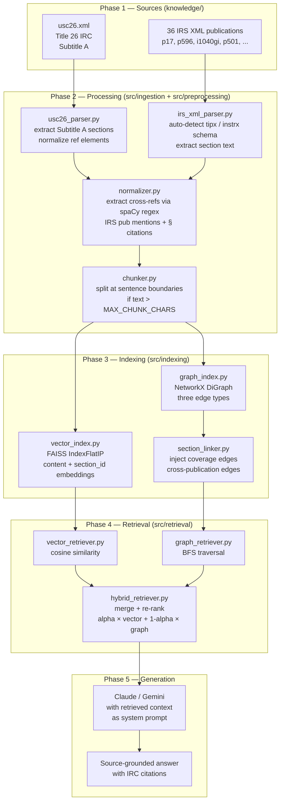
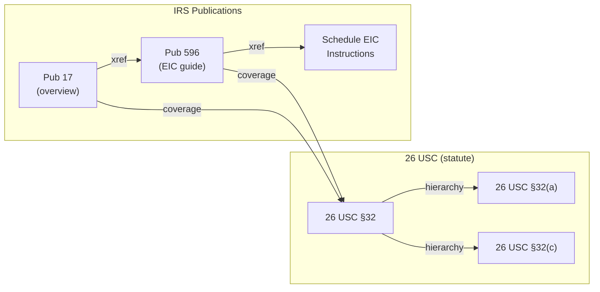
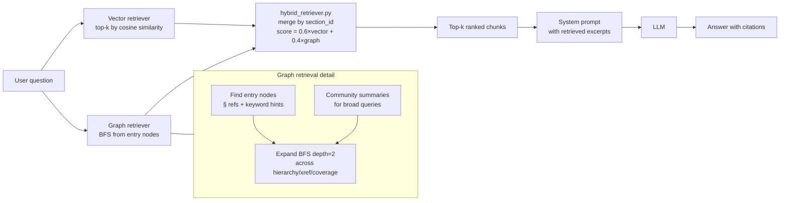

# Architecture

Hybrid GraphRAG system for federal income tax Q&A.  The system pairs a
NetworkX knowledge graph with a FAISS vector index so that retrieval can
follow cross-publication reference chains (graph traversal) and semantic
similarity (vector search) at the same time.

---

## Full Pipeline



---

## Knowledge Graph: Three Edge Types



**Why three edge types matter:**

A flat vector index might retrieve Pub 17 for a query about the EIC — but it
has no mechanism to follow the Pub 17 → Pub 596 → §32 chain.  Explicit edge
types let BFS traversal recover all three nodes in two hops, so the LLM
receives the statutory text, the plain-language guide, and the form
instructions together.

| Edge type   | Source             | Captures                                      |
| ----------- | ------------------ | --------------------------------------------- |
| `hierarchy` | XML tree structure | Parent section → child subsection             |
| `xref`      | `<ref>` tags + NLP | Explicit §NNN citations and pub name mentions |
| `coverage`  | section_linker.py  | Curated IRS pub ↔ IRC section relationships   |

---

## Retrieval Flow



---

## Evaluation Design

Four retrieval conditions are run for each LLM.  Comparing `none` vs
`hybrid` isolates the contribution of GraphRAG.

```
                 mode=none   mode=vector   mode=graph   mode=hybrid
claude-sonnet       ✓            ✓             ✓             ✓
gemini-2.5-pro      ✓            ✓             ✓             ✓
```

**Metric:** rubric-based LLM-as-judge score (points earned / points possible).
The judge receives the scoring rubric and the model response, and assigns
partial credit for each criterion.

---

## File Interaction Map

```
scripts/build_pipeline.py
  calls  src/ingestion/usc26_parser.py
  calls  src/ingestion/irs_xml_parser.py
  calls  src/preprocessing/normalizer.py
  calls  src/preprocessing/chunker.py
  calls  src/indexing/vector_index.py   → data/processed/vector_*.faiss + vector_meta.json
  calls  src/indexing/graph_index.py    → data/processed/graph.graphml + communities.json
    calls  src/indexing/section_linker.py  (called by graph_index.py internally)
  calls  src/indexing/graph_audit.py    → data/processed/graph_audit.json

chatbot.py
  calls  src/retrieval/hybrid_retriever.py
    calls  src/retrieval/vector_retriever.py   (loads FAISS indexes)
    calls  src/retrieval/graph_retriever.py    (loads graph.graphml)
  calls  Claude API / Gemini API

evaluation/run_eval.py
  calls  src/retrieval/hybrid_retriever.py
  calls  Claude API / Gemini API  (generation + judge)
  calls  evaluation/datasets/<name>.py
```
