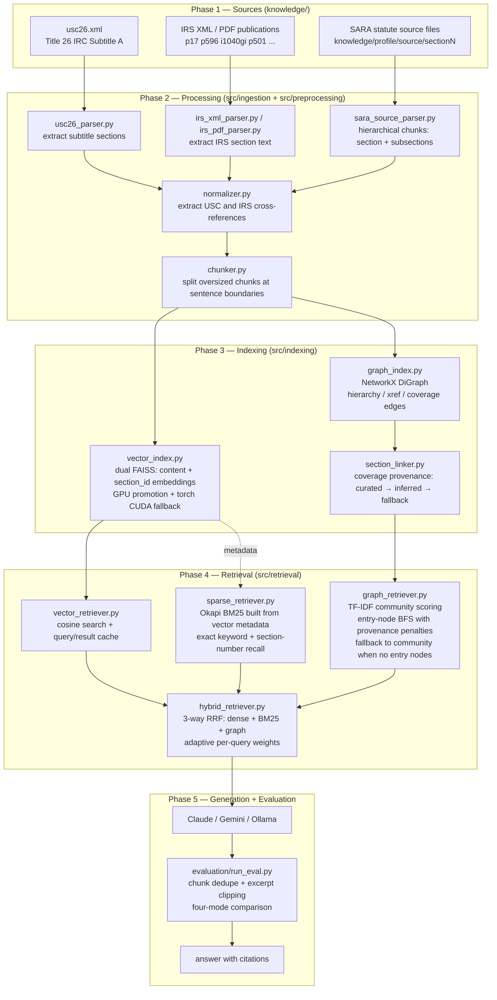
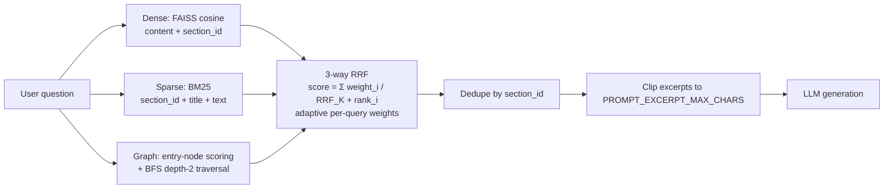

# Architecture

Hybrid GraphRAG system for federal income tax Q&A. At query time three
independent retrievers run in parallel and their ranked lists are fused via
Reciprocal Rank Fusion (RRF) before generation:

- **Dense vector** — semantic similarity via FAISS + sentence embeddings
- **Sparse BM25** — exact keyword and section-number recall (no embeddings)
- **Graph BFS** — structured traversal over statute hierarchy, cross-references,
  and publication coverage edges

Vector search is hardware-adaptive:

1. FAISS GPU when FAISS CUDA bindings are available
2. Torch CUDA matrix search when CUDA exists but FAISS GPU is unavailable
3. FAISS CPU everywhere else

---

## Full Pipeline



---

## SARA Source Chunk Hierarchy

SARA statute source files (`knowledge/<profile>/source/section63`, etc.) are
parsed into a two-level hierarchy:

| Level | `section_id` example | `parent_id` |
| --- | --- | --- |
| Section | `26 USC §63` (full text) | `None` |
| Subsection | `26 USC §63(a)` | `26 USC §63` |

Each subsection chunk includes the section header and any intro text before
`(a)` so every chunk is self-contained for retrieval. Paragraphs `(1)(2)…`,
sub-paragraphs `(A)(B)…`, and clauses `(i)(ii)…` are kept inline inside the
subsection chunk — splitting at that depth creates fragments too small to be
useful without context.

`cross_refs` on each subsection chunk contains both the section ref
(`26 USC §63`) and the subsection ref (`26 USC §63(a)`), so both
retrieval-metric matching and graph edge construction work correctly.

---

## Graph Edge Model

```mermaid
flowchart LR
    subgraph USC["26 USC (statute)"]
        S32[26 USC §32]
        S32a[26 USC §32(a)]
        S32c[26 USC §32(c)]
    end

    subgraph IRS["IRS publications"]
        P17[Pub 17]
        P596[Pub 596]
        EIC[Schedule EIC Instructions]
    end

    S32 -->|hierarchy| S32a
    S32 -->|hierarchy| S32c
    P17 -->|coverage| S32
    P596 -->|coverage| S32
    P17 -->|xref| P596
    P596 -->|xref| EIC
```

| Edge type | Source | Purpose |
| --- | --- | --- |
| `hierarchy` | XML / SARA parser `parent_id` | parent → child statute navigation |
| `xref` | normalizer cross-reference extraction | explicit statute / pub cross-citations |
| `coverage` | section_linker (curated + inferred + fallback) | publication-to-statute grounding |

Coverage edge provenance labels (used to penalise lower-confidence edges during BFS):

- `curated_section`, `curated_cross_pub`
- `inferred_section`, `inferred_cross_pub`
- `fallback`

---

## Retrieval Flow



### Adaptive weight selection

| Query type | dense | BM25 | graph |
| --- | --- | --- | --- |
| Has `§N` / `section N` | 1.0 | 2.0 | 2.5 |
| Numeric (`how much`, `rate`, `bracket`) | 1.5 | 1.0 | 1.5 |
| Default / broad | 1.0 | 1.5 | 2.0 |

Graph receives the highest default weight because its MRR (0.47) is dramatically
higher than dense MRR (0.07) in the full 2017 corpus.  BM25 adds exact-match
recall orthogonal to dense errors; RRF fusion of both is consistently better than
either alone (Rackauckas, arXiv:2402.03367).

### Graph retrieval strategy

1. **Broad queries** (≤12 words, no § reference): communities ranked by
   TF-IDF-weighted keyword overlap (IDF precomputed at init; rare terms score
   higher than common ones like "income").
2. **Specific queries**: entry nodes matched by § references + topic-keyword
   hints, then BFS-expanded with hop-decay scoring and edge-type priorities.
   Falls back to community mode when no entry nodes are found.

---

## Vector Backend Selection

| Condition | Backend used |
| --- | --- |
| `VECTOR_SEARCH_BACKEND=faiss` | FAISS CPU (always) |
| `VECTOR_SEARCH_BACKEND=torch` | Torch CUDA matmul (falls back to FAISS if CUDA missing) |
| `VECTOR_SEARCH_BACKEND=auto` + FAISS GPU available | FAISS GPU |
| `VECTOR_SEARCH_BACKEND=auto` + CUDA only | Torch CUDA matmul |
| `VECTOR_SEARCH_BACKEND=auto` + CPU only | FAISS CPU |

---

## Evaluation Notes

Four retrieval modes are compared per model:

| Mode | What runs |
| --- | --- |
| `none` | LLM parametric memory only — no retrieval |
| `vector` | Dense FAISS only |
| `graph` | Graph BFS / community only |
| `hybrid` | 3-way RRF: dense + BM25 + graph |

Key runtime details:

- Retrieved chunks are deduped by `section_id` before prompting
- Excerpts are clipped to `PROMPT_EXCERPT_MAX_CHARS` (default 1000 chars)
- SARA retrieval query excludes case body text by default to reduce noise
- Model and judge CLI accept `ollama:<model-name>` for direct local model selection
- All Ollama requests include `num_gpu=OLLAMA_NUM_GPU` (default 99) to force GPU offload
- Each case result is appended to a `.partial.jsonl` immediately; re-runs resume from there

### SARA-specific prompt flow

```text
%Text (natural language facts)
      +
%Facts (statutory Prolog predicates only — NLP span annotations stripped)
  e.g.  s63("Alice",2017,554313)  →  Alice's §63 income in 2017 = $554,313
      +
Question + type-specific step guidance
  label:   What exact condition does the law impose? / Do the facts satisfy it?
  numeric: State the formula / Substitute values / Show arithmetic
  string:  What does the law define? / Which facts apply?
      +
System: three-step reasoning format — Final Answer is mandatory
        Step 1 — Legal Rule: exact condition from the statute
        Step 2 — Facts Applied: map each fact to the condition
        Step 3 — Reasoning: why facts do/do not satisfy the rule
        Final Answer: <value-or-label>
```

| Case type | `SARA_MAX_TOKENS_*` default |
| --- | --- |
| label | 4000 |
| numeric | 5000 |
| string | 4000 |
| default | 4000 |

---

## File Interaction Map

```text
scripts/build_pipeline.py
  -> src/ingestion/usc26_parser.py
  -> src/ingestion/irs_xml_parser.py
  -> src/ingestion/irs_pdf_parser.py
  -> src/ingestion/sara_source_parser.py      (hierarchical SARA statute chunks)
  -> src/preprocessing/normalizer.py
  -> src/preprocessing/chunker.py
  -> src/indexing/vector_index.py             (vector_*.faiss + vector_meta.json)
  -> src/indexing/graph_index.py              (graph.graphml + communities.json)
      -> src/indexing/section_linker.py
  -> src/indexing/graph_audit.py              (graph_audit.json)

chatbot.py
  -> src/retrieval/hybrid_retriever.py
      -> src/retrieval/vector_retriever.py    (dense FAISS)
      -> src/retrieval/sparse_retriever.py    (BM25, built from vector metadata)
      -> src/retrieval/graph_retriever.py     (BFS + community)
  -> selected LLM provider

evaluation/run_eval.py
  -> src/retrieval/hybrid_retriever.py
  -> evaluation/datasets/<name>.py
  -> selected generation and judge providers

src/utils/ref_patterns.py      shared USC / IRS regex (normalizer + graph retriever)
src/utils/reference_matching.py  hierarchical section-id match scoring (eval metrics)
```
